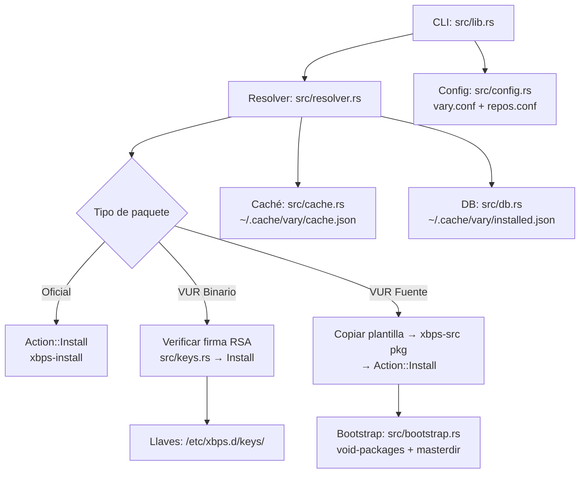

[English](README.md) | Español

# vary

Gestor comunitario de paquetes para **Void Linux**, construido sobre `xbps` y `xbps-src`.

> **Fork de [paru](https://github.com/Morganamilo/paru).** vary reutiliza la experiencia de uso de paru (interfaz familiar, búsqueda e instalación interactiva) pero interactúa exclusivamente con el ecosistema XBPS: nada de pacman ni de ALPM. El port y el desarrollo actual son obra de **Dicov ([SrDicov](https://github.com/SrDicov))**; todo el crédito del trabajo original corresponde a Morganamilo y la comunidad de paru.

Su pieza central es el protocolo **VUR**: repos Git distribuidos que combinan plantillas estilo `void-packages` con un índice declarativo `.VURINFO` (JSON) generado por CI, y opcionalmente binarios servidos por HTTP y firmados con `xbps-rindex`.

## Estado

**MVP en desarrollo.** La rama `vary-mvp` contiene una implementación parcial e inestable: la interfaz de comandos y los formatos pueden cambiar sin previo aviso.

## Requisitos

- **Void Linux** con `xbps` y `xbps-src` instalados (junto a `base-devel` para compilar).
- **`git`** — usado para clonar `void-packages` y los repos VUR. Es obligatorio: `git es requerido por vary pero no está instalado. Instálalo con: xbps-install git` es el error de arranque que muestra vary si no lo encuentra.

## Inicio rápido

No hay pasos manuales de bootstrap: en el primer `vary -Syu`, vary clona automáticamente `void-packages` en `~/.cache/vary/void-packages`, prepara el *masterdir* de `xbps-src` y crea sus cachés locales.

```sh
# Sincronizar/bootstrap inicial (clona void-packages y prepara xbps-src)
vary -Syu

# Buscar en los repos oficiales y en los VUR registrados
vary -Ss firefox

# Instalar un paquete
vary -S firefox

# Registrar un repo VUR remoto (se clona en ~/.local/share/vary/vurs/ y se
# registra en /etc/xbps.d/20-vur-<nombre>.conf).
# La rama por defecto se autodetecta (main, master, ...); fórzala con --branch.
vary --repo add https://git.example.com/usuario/vur.git
vary --repo add https://github.com/SrDicov/z-packages z-packages --branch master
```

Otros comandos disponibles en el MVP: `-Si` (información detallada), `-Sw` (descargar sin instalar), `-R` (eliminar), `--repo list|remove|rekey|re-trust` (re-trust reafirma la llave rotada de un repo), `--force-build` (compilar desde fuente aunque exista binario: prefiere candidatos de fuente entre repositorios y evita el bucket official cuando hay template VUR — avisa explícitamente si no puede) y `--prefer-binary` (priorizar binarios firmados, cambiando de repositorio si hace falta; `--no-prefer-binary` fuerza la vía de fuente). Sin estos flags rige la precedencia histórica (official primero, luego el candidato VUR fusionado). `--yes` es alias de `--noconfirm` (ojo: `-y` significa refresh, no yes); `--asdeps`/`--asexplicit` se rechazan (vary instala siempre como explícito). `-Sp` imprime el plan de instalación (niveles topológicos, batch binaria única, elevaciones estimadas) sin cambiar nada: parseable por scripts, sin lock, sin descargas, sin elevación.

## Configuración

Configuración de usuario en `~/.config/vary/vary.conf` (opcional; ejemplo completo en [`etc/vary.conf.example`](./etc/vary.conf.example)):

```toml
[general]
cache_dir = "~/.cache/vary"
data_dir = "~/.local/share/vary"
log_level = "info"

[build]
max_concurrent_builds = 2
force_rebuild = false

[search]
ttl_cache_seconds = 3600
```

La elevación de privilegios es agnóstica: vary usa lo configurado en `--sudo`/`sudo_bin` (`sudo`, `doas`, `run0`), autodetecta en ese orden si no hay nada configurado, y no usa wrapper alguno al correr como root.

Los repos VUR se declaran en `~/.config/vary/repos.conf`:

```toml
[vur.mi-vur]
url = "https://git.example.com/usuario/vur.git"
branch = "main"
priority = 10
# Opcional: índice binario remoto estilo VUP (index.json). Si se declara,
# vary instala los binarios de ese repo para tu arquitectura sin necesitar
# .VURINFO ni plantillas (adaptador Fase 1, solo binarios).
# index_url = "https://vup-linux.github.io/vup/index.json"
```

Los repos que publican un `index.json` estilo VUP (p. ej. VUP-Linux/vup)
pueden usarse para instalaciones binarias:

```sh
vary --repo add https://github.com/VUP-Linux/vup vup \
  --index-url https://vup-linux.github.io/vup/index.json
vary -S vlang   # instalación binaria desde el release correspondiente
```

Notas: requiere `curl` (configurable vía `--curl` / `[general] curl_bin`); la
llave `keys/*.plist` del repo se verifica como cualquier llave VUR
(`key_fingerprint` en repos.conf); compilar desde fuente de estos repos aún
no está soportado. En el primer install binario, vary pre-importa la llave
al keyring de xbps, así que solo se pide la confirmación de confianza de
vary (sin segundo prompt de importación de xbps). El fingerprint que muestra
vary coincide con el de xbps: pínalo vía `key_fingerprint`.

## Repositorio binario

Un repositorio XBPS rodante con paquetes firmados vive en una URL fija y se refresca en cada build exitoso:

```sh
echo 'repository=https://github.com/SrDicov/Vary/releases/download/repo' | sudo tee /etc/xbps.d/20-vary.conf
sudo xbps-install -S        # acepta la huella RSA cuando pregunte
sudo xbps-install vary      # luego: sudo xbps-install -Su lo mantiene al día
```

Se sirven glibc y musl desde esa única URL (`x86_64` / `x86_64-musl`). La clave pública de firma está publicada en [`keys/vary-repo.pub.pem`](./keys/vary-repo.pub.pem).

## Arquitectura



Directorios relevantes:

| Ruta | Uso |
| --- | --- |
| `~/.cache/vary/void-packages/` | checkout de `void-packages` usado por `xbps-src` |
| `~/.cache/vary/cache.json` | caché de búsquedas/metadatos |
| `~/.cache/vary/installed.json` | base de datos de paquetes gestionados por vary |
| `~/.cache/vary/logs/` | registros de compilación |
| `~/.local/share/vary/vurs/` | clones locales de los repos VUR |
| `~/.config/vary/vary.conf`, `~/.config/vary/repos.conf` | configuración de usuario |
| `/etc/xbps.d/10-vary.conf`, `/etc/xbps.d/20-vur-<nombre>.conf` | integración con xbps |

## Limitaciones conocidas (MVP)

Durante el MVP, vary prioriza simplicidad sobre exhaustividad: la resolución de dependencias de paquetes VUR se basa en el índice declarativo `.VURINFO` que publica cada repositorio, no en una evaluación completa de las plantillas en tu máquina. Eso implica restricciones importantes descritas a continuación, además de que faltan funcionalidades planeadas (ver hoja de ruta).

> NOTA SOBRE VARIABLES DINÁMICAS: El .VURINFO generado por scripts/vur-generator.sh refleja las opciones de compilación POR DEFECTO (sin XBPS_PKG_OPTIONS activos). Si el usuario final compila con opciones personalizadas (XBPS_PKG_OPTIONS_<pkg>), la resolución de dependencias inicial puede ser incompleta. xbps-src manejará las dependencias adicionales durante la compilación real. Esto es aceptable para el MVP: la resolución del DAG es una optimización para minimizar builds innecesarios, no una garantía de completitud.

Usa `-v`/`-vv` para salida DEBUG/TRACE en consola (`RUST_LOG` los precede); `log_level` en `vary.conf` fija el nivel por defecto.

## Hoja de ruta

- **Fase 2 — builds concurrentes:** compilaciones paralelas limitadas por `max_concurrent_builds` mediante `tokio::sync::Semaphore` (hoy los builds son secuenciales).
- **Fase 2 — `regen-aur` automatizado:** comando tipo `vary --repo regen-aur <pkg>` para refrescar plantillas derivadas del AUR sin pasos manuales (ver [`docs/AUR2XBPS.md`](./docs/AUR2XBPS.md)).

## Licencia y créditos

GPL-3.0. vary es un port del excelente trabajo de Morganamilo y la comunidad de [paru](https://github.com/Morganamilo/paru); todo el crédito de la autoría original les corresponde. El port a Void Linux/XBPS y el desarrollo actual son de **Dicov ([SrDicov](https://github.com/SrDicov))**. Ver [LICENSE](./LICENSE).
