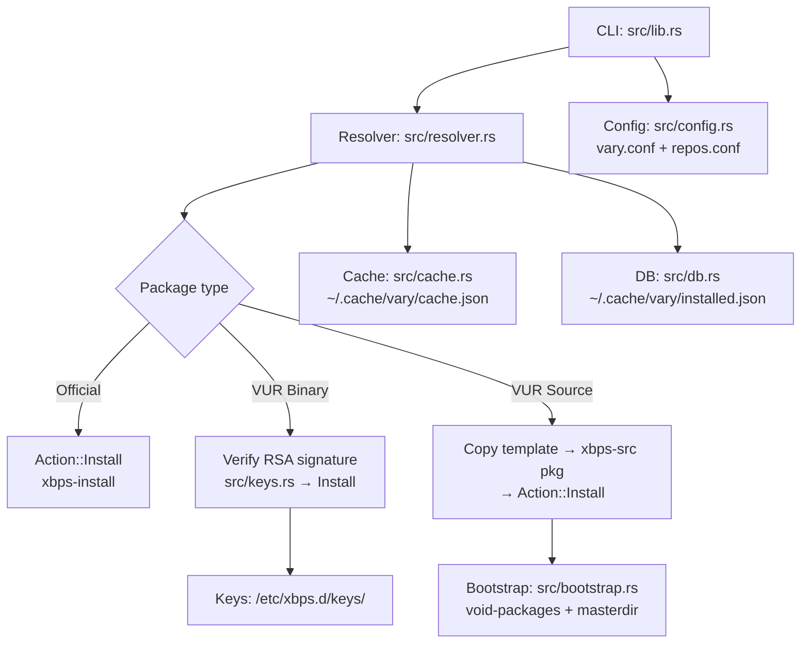

[English](README.md) | [Español](README.es.md)

# vary

A community package manager for **Void Linux**, built on top of `xbps` and `xbps-src`.

> **Fork of [paru](https://github.com/Morganamilo/paru).** vary reuses paru's user experience (familiar interface, interactive search and install) but talks exclusively to the XBPS ecosystem: no pacman, no ALPM. The port and current development are by **Dicov ([SrDicov](https://github.com/SrDicov))**; all credit for the original work goes to Morganamilo and the paru community.

Its core piece is the **VUR** protocol: distributed Git repositories that combine `void-packages`-style templates with a declarative `.VURINFO` (JSON) index generated by CI, plus optional HTTP-served binaries signed with `xbps-rindex`.

## Status

**MVP under development.** The `vary-mvp` branch contains a partial, unstable implementation: command interfaces and formats may change without notice.

## Requirements

- **Void Linux** with `xbps` and `xbps-src` installed (plus `base-devel` to compile).
- **`git`** — used to clone `void-packages` and VUR repos. It is mandatory: if missing, vary fails at startup with `git es requerido por vary pero no está instalado. Instálalo con: xbps-install git`.

## Quick start

There are no manual bootstrap steps: on the first `vary -Syu`, vary automatically clones `void-packages` into `~/.cache/vary/void-packages`, prepares the `xbps-src` *masterdir*, and creates its local caches.

```sh
# Initial sync/bootstrap (clones void-packages and prepares xbps-src)
vary -Syu

# Search official repos and registered VURs
vary -Ss firefox

# Install a package
vary -S firefox

# Register a remote VUR repo (cloned into ~/.local/share/vary/vurs/ and
# registered in /etc/xbps.d/20-vur-<name>.conf).
# The default branch is auto-detected (main, master, ...); override with --branch.
vary --repo add https://git.example.com/user/vur.git
vary --repo add https://github.com/SrDicov/z-packages z-packages --branch master
```

Other commands available in the MVP: `-Si` (detailed info), `-Sw` (download without installing), `-R` (remove), `--repo list|remove|rekey`, `--force-build` (build from source even if a binary exists) and `--prefer-binary` (prefer signed binaries over compiling). Scope note (T-010, fixed in 0.3.1): both flags only decide *within* the selected VUR candidate — they never switch repositories nor override the official/xbps bucket. `--yes` is an alias of `--noconfirm` (note: `-y` means refresh, not yes); `--asdeps`/`--asexplicit` are rejected (vary always installs as explicit).

## Configuration

User configuration lives in `~/.config/vary/vary.conf` (optional; full example in [`etc/vary.conf.example`](./etc/vary.conf.example)):

```toml
[general]
cache_dir = "~/.cache/vary"
data_dir = "~/.local/share/vary"
log_level = "info"

[build]
max_concurrent_builds = 2
force_rebuild = false

[search]
ttl_cache_seconds = 3600
```

Privilege escalation is tool-agnostic: vary uses whatever is configured via `--sudo` / `sudo_bin` (`sudo`, `doas`, `run0`), auto-detects in that order when unset, and skips the wrapper entirely when running as root.

VUR repos are declared in `~/.config/vary/repos.conf`:

```toml
[vur.my-vur]
url = "https://git.example.com/user/vur.git"
branch = "main"
priority = 10
# Optional: VUP-style remote binary index (index.json). When set, vary
# installs that repo's binaries for your architecture without needing
# .VURINFO or templates (Phase 1 adapter, binary only).
# index_url = "https://vup-linux.github.io/vup/index.json"
```

Repos that publish a VUP-style `index.json` (e.g. VUP-Linux/vup) can be used
for binary installs:

```sh
vary --repo add https://github.com/VUP-Linux/vup vup \
  --index-url https://vup-linux.github.io/vup/index.json
vary -S vlang   # binary install from the matching release repo
```

Notes: needs `curl` (configurable via `--curl` / `[general] curl_bin`); the
repo's `keys/*.plist` key is verified like any VUR key (`key_fingerprint`
in repos.conf); source builds from such repos are not supported yet.

## Binary repository

A rolling XBPS repository with signed packages lives at a fixed URL and is refreshed on every successful build:

```sh
echo 'repository=https://github.com/SrDicov/Vary/releases/download/repo' | sudo tee /etc/xbps.d/20-vary.conf
sudo xbps-install -S        # accept the RSA fingerprint when prompted
sudo xbps-install vary      # later: sudo xbps-install -Su keeps it current
```

Both glibc and musl are served from that single URL (`x86_64` / `x86_64-musl`). The signing public key is published as [`keys/vary-repo.pub.pem`](./keys/vary-repo.pub.pem).

## Architecture



Relevant directories:

| Path | Purpose |
| --- | --- |
| `~/.cache/vary/void-packages/` | `void-packages` checkout used by `xbps-src` |
| `~/.cache/vary/cache.json` | search/metadata cache |
| `~/.cache/vary/installed.json` | database of packages managed by vary |
| `~/.cache/vary/logs/` | build logs |
| `~/.local/share/vary/vurs/` | local clones of VUR repos |
| `~/.config/vary/vary.conf`, `~/.config/vary/repos.conf` | user configuration |
| `/etc/xbps.d/10-vary.conf`, `/etc/xbps.d/20-vur-<name>.conf` | xbps integration |

## Known limitations (MVP)

During the MVP, vary favors simplicity over completeness: VUR dependency resolution is based on the declarative `.VURINFO` index published by each repository, not on fully evaluating templates on your machine. That implies important restrictions described below, plus planned features that are still missing (see roadmap).

> NOTE ON DYNAMIC VARIABLES: The .VURINFO generated by scripts/vur-generator.sh reflects DEFAULT build options (no active XBPS_PKG_OPTIONS). If the end user builds with custom options (XBPS_PKG_OPTIONS_<pkg>), initial dependency resolution may be incomplete. xbps-src will handle additional dependencies during the real build. This is acceptable for the MVP: DAG resolution is an optimization to minimize unnecessary builds, not a completeness guarantee.

> KNOWN ISSUES (0.3.1 milestone, see `test/REPORT.md`): `-v`/`-vv` have no effect on console output (workaround: `RUST_LOG=debug`) — T-002. `--force-build`/`--prefer-binary` never switch repositories nor override official binaries (T-010). The first install from a VUP binary repo requires an interactive run (xbps asks to import its key; fail-closed without it) — T-012.

## Roadmap

- **Phase 2 — concurrent builds:** parallel builds limited by `max_concurrent_builds` via `tokio::sync::Semaphore` (today builds are sequential).
- **Phase 2 — automated `regen-aur`:** a `vary --repo regen-aur <pkg>` style command to refresh AUR-derived templates without manual steps (see [`docs/AUR2XBPS.md`](./docs/AUR2XBPS.md)).

## License & credits

GPL-3.0. vary is a port of the excellent work by Morganamilo and the [paru](https://github.com/Morganamilo/paru) community; all credit for the original authorship belongs to them. The Void Linux/XBPS port and current development are by **Dicov ([SrDicov](https://github.com/SrDicov))**. See [LICENSE](./LICENSE).
